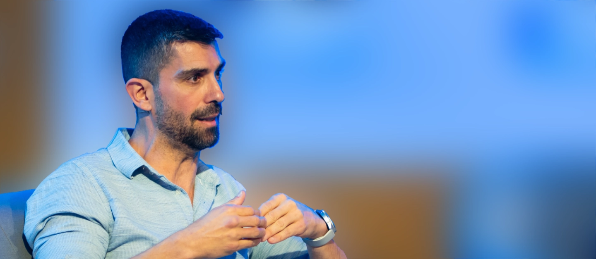

  

<h1 align="center">Salvador Valle Vargas</h1>

  <strong>Product &amp; UX Design Director</strong> 
  Leading teams, shaping product direction, and exploring what comes next.

  
   | 
  

Product strategy &middot; Design leadership &middot; Research &middot; Emerging technology

I have spent three decades learning, sharing, investigating, playing, and occasionally rolling with the punches. My work sits where product strategy, design leadership, user research, and emerging technology meet.

I care about building the conditions for good decisions: teams with a clear purpose, research that changes direction, and products that make a meaningful difference to the people using them. New tools matter when they help us think better, not simply move faster.

## The Work I Care About

- **Leading design and product teams** with a shared language, clear priorities, and room to grow.
- **Turning research into product direction** by connecting user needs, business opportunity, and delivery reality.
- **Exploring AI and new interaction models** with practical intent, from immersive experiences to voice, gesture, and intelligent tools.
- **Teaching, facilitating, and sharing** ideas that help people see their work from a different angle.

## A Few Chapters So Far

| When | Role | Focus |
| --- | --- | --- |
| 2024-present | **Product Design Director, Harbiz** | Defined product design strategy, led the creation of the Zeus design system with engineering, directed research for opportunities in Latin America, and grew the team by five specialists across product design, content, research, and design systems. |
| 2023-2024 | **Experience Design Director, Hamon** | Design, innovation, strategy, and creative technology for new experience and relationship models. |
| 2022-2023 | **Experience Design Director, frog** | Product direction, design strategy, people management, and new-business opportunities. |
| 2019-2022 | **Director of User Experience Design, Isobar** | UX strategy, team leadership, product and project direction, and new-business work. |
| 2013-2019 | **UX Strategist to Head of Design & User Experience, BBVA Next Technologies** | Built UX strategy and teams while researching new interaction systems, including VR, AR, voice, and gesture. |

Earlier chapters include creative direction, UX consulting, digital product work, and teaching across agencies, consultancies, and education. That range still informs how I lead: with enough strategic altitude to set direction and enough craft awareness to make it real.

## Selected Impact

> **ZEUS. Designing a new way to work**: Add a concise example of a product or service outcome, including the problem, your leadership contribution, and a measurable result.

> **Redifining the relation with the citizenship**: Add a concise example of how research, a design system, or a new process changed a team or product decision.

> **To be completed**: Add a concise example of team growth, capability building, or cross-functional influence.

## Talks & Writing

- [Interfaz cero: El futuro de la interacción](https://youtu.be/Q2Kxqw2eS1s?si=BY3WjdPoDvYr56kn), LaProductConf 2024.
- [The ROI of Design roundtable, LaProductConf 2024](https://linktr.ee/salvadorvalle).
- [Experience Fighters talk on VR and the metaverse](https://linktr.ee/salvadorvalle).
- [Diseña mundos, diseñarás mejor](https://medium.com/isobar-spain/dise%C3%B1a-mundos-dise%C3%B1ar%C3%A1s-mejor-7a55b4ce352f), on design beyond the familiar.
- [Usability was born to save your life. UX, to help you enjoy it](https://medium.com/isobar-spain/la-usabilidad-naci%C3%B3-para-salvar-tu-vida-el-ux-para-que-la-disfrutes-c5a077f30ffa).
- [Visual Thinking for Muggles: Getting started](https://www.bbva.com/es/la-iniciacion-en-visual-thinking-para-muggles/).
- [More talks, articles, and publications](https://linktr.ee/salvadorvalle).

## Exploring in Public

I am currently learning through hands-on work with AI-assisted development, modern web technologies, and emerging design methods. I am interested in how these tools reshape the way design and product teams collaborate, make decisions, and build.

> **To be completed**: Add selected repositories or experiments here, each with a short note on the question it explores and what you learned.

If you are thinking about product, design leadership, AI, or the future of interaction, [let's connect on LinkedIn](https://www.linkedin.com/in/salvadorvalle/).
